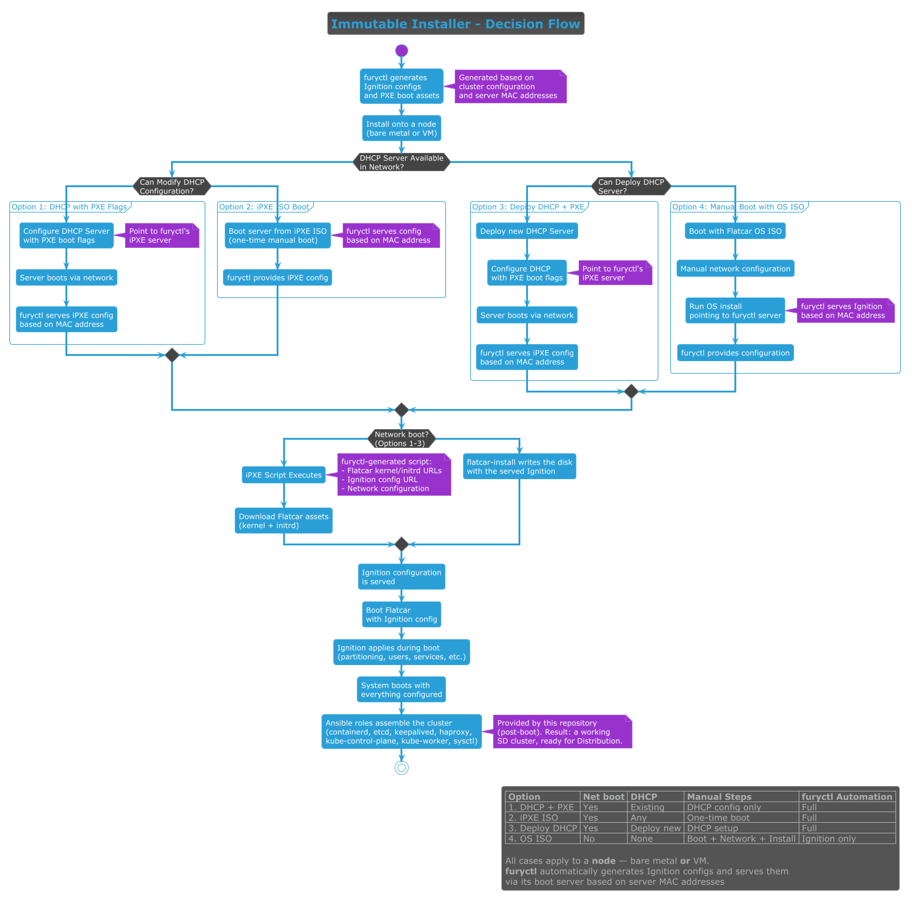

<!-- markdownlint-disable MD013 MD060 -->
# Installing the SIGHUP Distribution Immutable Kind

[`furyctl`][furyctl] is the cluster lifecycle CLI for the [SIGHUP Distribution (SD)][sd-repo]. Its
**Immutable kind** — implemented by this repository — installs Kubernetes onto a **node**, which may be a
**bare-metal machine or a virtual machine**. This page is the overview: it shows the boot decision, links to a
focused document per case, and describes the flow that every case shares. Key terms link to their official
docs inline on first mention.

> **Scope — what actually runs the install.** The boot and provisioning described here (Ignition generation,
> iPXE serving, the boot cases) is performed by [`furyctl`][furyctl], **not by this repository**. This
> repository provides the post-boot [Ansible roles](../roles) that assemble Kubernetes once a node is already
> running [Flatcar][flatcar]. Your job is to configure the environment (DHCP / PXE / boot media) so furyctl
> can reach each node and serve it the right config.

## Prerequisites

The Immutable kind is **alpha** and is driven entirely by [`furyctl`][furyctl] — install **furyctl ≥ 0.34.2**
(see the [compatibility matrix][compatibility-matrix]). Before you start, gather:

- **A furyctl host** — a machine that runs furyctl and whose built-in boot server (HTTP, default port `8080`)
  every node can reach over the network.
- **Per node:** its **MAC address**, the **install disk** (e.g. `/dev/sda`), and its network settings
  (static IP / gateway / DNS, or DHCP).
- **An SSH key pair** — the public key is injected into every node for `core`-user access, and furyctl uses
  the private key to connect after boot.
- **`kubectl`** on the furyctl host, to verify the cluster afterwards.

## The boot decision: pick your case

How a node gets bootstrapped depends on the network — specifically, whether a [DHCP][dhcp] server exists and
whether you can change it. The decision tree is captured in the diagram below
([source `.puml`](immutable-baremetal-decision.puml)):



The four cases are **target-agnostic** — they apply whether the node is bare metal or a VM (a VM is just a node
on a virtual network, with media attached as a virtual CD-ROM). Pick the one that matches your network:

| Your network situation                    | Case document                                          | What you set up |
| ----------------------------------------- | ------------------------------------------------------ | --------------- |
| [DHCP][dhcp] exists **and** you can modify it | [Existing DHCP with PXE flags](install-case-dhcp-pxe.md)   | Add UEFI HTTP-boot options to your existing DHCP |
| DHCP exists but you **cannot** modify it  | [iPXE ISO boot](install-case-ipxe-iso.md)                  | Boot each node once from an iPXE ISO/USB (generator script is a TODO; manual chainload meanwhile) |
| No DHCP, but you **can deploy** one       | [Deploy a new DHCP + PXE](install-case-deploy-dhcp.md)     | Deploy dnsmasq + an HTTP host for `ipxe.efi` |
| No DHCP **and** none deployable           | [Manual OS ISO install](install-case-os-iso.md)            | Hand-install each node from the Flatcar OS ISO |

**furyctl's own work is identical in every row** — it generates the boot assets, serves them over HTTP, waits
for the nodes to report booted, and runs the Ansible roles (see [Shared flow](#shared-flow-every-case)). The
rows differ only in the external boot setup **you** provide: cases 1–3 get the node to fetch furyctl's assets
over the network via [iPXE][ipxe]; case 4 is the manual fallback where you fetch the same [Ignition][ignition]
assets by hand. furyctl does **not** automate the [DHCP][dhcp]/PXE side in any case.

## Shared flow (every case)

Whatever case bootstraps the node, the rest of the install is the same:

1. **furyctl generates the assets.** From your cluster configuration and each node's **MAC address**,
   [`furyctl`][furyctl] generates **two** [Ignition][ignition] configs per node — `install-flatcar.json` and
   `node-configuration.json` — plus the per-MAC [iPXE][ipxe] boot script and the [Flatcar][flatcar]
   kernel/initrd/image and [systemd-sysext][sysext] assets, then serves each node the right files **based on its
   MAC address**.
2. **The node boots the live installer (stage 1).** Per the chosen case, the node reaches furyctl's HTTP server
   and fetches its per-MAC iPXE script (`/boot/<MAC>`), which loads the Flatcar kernel/initrd and the
   **`install-flatcar.json`** Ignition. Flatcar boots **live** and runs [`flatcar-install`][flatcar-install],
   writing Flatcar to the install disk with this node's final config (`node-configuration.json`) embedded.
3. **The node reboots into the installed system (stage 2).** On first **disk** boot, **`node-configuration.json`**
   is applied — partitioning extra disks, creating the `core` user, writing network config, enabling services,
   and placing the pinned [systemd-sysext][sysext] component images. The node then POSTs `booted` to furyctl's
   `/status` endpoint.
4. **furyctl waits, then Ansible assembles the cluster.** furyctl's boot server **blocks until every node reports
   `booted`**; only then does it run the installer's [Ansible roles](../roles) — `containerd`, `etcd`, `keepalived`
   (the control-plane **VIP**), `haproxy` (APIServer load balancer), `kube-control-plane` (which runs
   [`kubeadm`][kubeadm] to bootstrap the control plane), `kube-worker`, and `sysctl` — turning a fleet of identical
   nodes into a working SD cluster, ready for the Distribution phase.

## Installing with furyctl

The boot environment from your chosen case is the only part that differs; the furyctl commands are the same for
every case:

1. **Scaffold the config.** Pick a `--version` supported for the Immutable kind (see the
   [compatibility matrix][compatibility-matrix]):

   ```sh
   furyctl create config --kind Immutable --version <vX.Y.Z> --name <cluster>
   ```

2. **Fill in `furyctl.yaml`** — the boot-server URL, SSH key paths, and one entry per node (its **MAC address**,
   **architecture**, install disk, and network). Minimal shape:

   ```yaml
   apiVersion: kfd.sighup.io/v1alpha2
   kind: Immutable
   metadata:
     name: <cluster>
   spec:
     distributionVersion: <vX.Y.Z>        # selects the SD/Kubernetes versions for this cluster
     infrastructure:
       ipxeServer:
         url: "http://<furyctl-host>:8080"   # built-in boot server; bindAddress/bindPort optional
       ssh:
         username: "core"
         privateKeyPath: "${HOME}/.ssh/id_ed25519"
         publicKeyPath: "${HOME}/.ssh/id_ed25519.pub"
       nodes:
         - hostname: "ctrl01.example.local"
           macAddress: "52:54:00:10:00:01"   # keys this node's per-MAC boot + Ignition config
           arch: "x86-64"                     # x86-64 | arm64 — furyctl resolves Flatcar/sysext assets per arch
           storage:
             installDisk: "/dev/sda"
           network:
             ethernets:
               eth0:
                 addresses: ["192.168.1.11/24"]
                 gateway: "192.168.1.1"
                 nameservers:
                   addresses: ["8.8.8.8"]

         - hostname: "worker01.example.local"
           macAddress: "52:54:00:10:00:02"
           arch: "x86-64"
           storage:
             installDisk: "/dev/sda"
           network:
             ethernets:
               eth0:
                 addresses: ["192.168.1.21/24"]
                 gateway: "192.168.1.1"
                 nameservers:
                   addresses: ["8.8.8.8"]
     kubernetes:
       networking:
         podCIDR: "10.244.0.0/16"
         serviceCIDR: "10.96.0.0/12"
       controlPlane:
         address: "ctrl01.example.local:6443"
         members:
           - hostname: "ctrl01.example.local"
       etcd:
         members:
           - hostname: "ctrl01.example.local"
       nodeGroups:
         - name: workers
           nodes:
             - hostname: "worker01.example.local"
     # spec.distribution.modules: see the SIGHUP Distribution docs
   ```

3. **Generate the PKI** (control-plane + etcd certificates):

   ```sh
   furyctl create pki
   ```

4. **Apply.** Either run all phases in one command, or split the `infrastructure` phase so you can power on the
   nodes while furyctl's boot server is running:

   ```sh
   furyctl apply                          # all phases: infrastructure, kubernetes, distribution, plugins

   # Or split the boot/provisioning gate from the remaining phases:
   furyctl apply --phase infrastructure   # serves per-MAC configs; power on the nodes now
   furyctl apply --start-from kubernetes  # continue: kubernetes, distribution, plugins
   ```

   **What this server is.** A **plain HTTP file server** (default bind `0.0.0.0:8080`; override with
   `spec.infrastructure.ipxeServer.bindAddress` / `bindPort`). It serves only static assets:

   - `/boot/<MAC>` — the per-node iPXE boot script
   - `/ignition/<MAC>/install-flatcar.json` and `/ignition/<MAC>/node-configuration.json` — the two Ignition stages
   - `/assets/...` — Flatcar kernel/initrd/image and [systemd-sysext][sysext] packages
   - `/status` — nodes POST here to report `booted`; furyctl blocks here until **all** nodes are booted

   It does **not** run [DHCP][dhcp] or [TFTP][tftp], and it does **not** serve `ipxe.efi` — that network-boot
   plumbing is the external setup your chosen case provides. You can also run the server standalone:
   `furyctl serve --address 0.0.0.0 --port 8080 --path <workdir>/.../infrastructure/server` (flags: `-a` address,
   `-p` port, `-x` path).

## Verify the cluster

When `furyctl apply` finishes, point `kubectl` at the kubeconfig furyctl writes to the working directory and
check the nodes:

```sh
export KUBECONFIG="$PWD/kubeconfig"   # path furyctl reports at the end of apply
kubectl get nodes
```

Every control-plane and worker node from `furyctl.yaml` should appear and reach **Ready**. From here the cluster
is ready for the Distribution phase.

<!-- Links -->

[sd-repo]: https://github.com/sighupio/distribution/
[furyctl]: https://github.com/sighupio/furyctl/
[flatcar]: https://www.flatcar.org/
[ignition]: https://coreos.github.io/ignition/
[sysext]: https://www.freedesktop.org/software/systemd/man/latest/systemd-sysext.html
[ipxe]: https://ipxe.org/
[dhcp]: https://datatracker.ietf.org/doc/html/rfc2131
[tftp]: https://datatracker.ietf.org/doc/html/rfc1350
[flatcar-install]: https://www.flatcar.org/docs/latest/installing/bare-metal/installing-to-disk/
[kubeadm]: https://kubernetes.io/docs/reference/setup-tools/kubeadm/
[compatibility-matrix]: COMPATIBILITY_MATRIX.md
