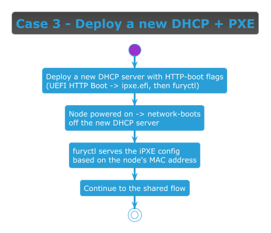

<!-- markdownlint-disable MD013 -->
# Install case: deploy a new DHCP + PXE

> Part of the [Immutable install guide](IMMUTABLE_INSTALL.md). Key terms link to their official docs inline.

## When to use this case

Use this case when the network segment **has no [DHCP][dhcp] server, but you are able to deploy one**. After
standing up DHCP for [UEFI HTTP Boot][uefi-httpboot], the path is the same fully-automated network boot as the
"existing DHCP" case (**UEFI-only** — legacy BIOS is not supported). The target node can be **bare metal or a
virtual machine** — for VMs, the new DHCP service is typically a small VM on the same virtual network.

## Flow



> [Diagram source](immutable-case-deploy-dhcp.puml) · continues into the
> [Shared flow (every case)](IMMUTABLE_INSTALL.md#shared-flow-every-case).

## How to set it up

[`furyctl`][furyctl] serves the iPXE script and [Ignition][ignition] config but **does not run DHCP** — and it
does **not** serve `ipxe.efi` either. So the new DHCP service must hand UEFI HTTP-Boot firmware the `ipxe.efi`
bootloader over **[HTTP][http]** (no [TFTP][tftp]) and then chainload iPXE clients to furyctl. This path is
**UEFI-only**: [UEFI HTTP Boot][uefi-httpboot] needs UEFI 2.5+ firmware; legacy BIOS cannot HTTP boot and is not
supported here.

There is **no official [`dnsmasq`][dnsmasq] container**, so — following the Flatcar / [matchbox][matchbox]
ecosystem recommendation — we deploy `quay.io/poseidon/dnsmasq` for **DHCP**. But **dnsmasq has no built-in HTTP
server**: it tells the firmware where to GET `ipxe.efi` but cannot serve it. So you also need a small **HTTP file
server** for `ipxe.efi` ([nginx][nginx], [Caddy][caddy], or `python3 -m http.server`). The dnsmasq image bundles
`ipxe.efi` in its (now-unused) TFTP root — copy it out, or download it from [boot.ipxe.org][ipxe-download] — and
serve it from that HTTP host.

Run the container on a host reachable on the node's network segment. There are **two equivalent ways** — pick
whichever fits your workflow.

### Option A — declarative (config file, clean command)

Copy [`examples/dnsmasq.conf`](examples/dnsmasq.conf) (validated with `dnsmasq --test`), set `<furyctl-host>`
and `<http-host>` (the HTTP server hosting `ipxe.efi`) in it, then mount it into the container:

```sh
docker run --rm --cap-add=NET_ADMIN --net=host \
  -v "$PWD/dnsmasq.conf:/etc/dnsmasq.conf:ro" \
  quay.io/poseidon/dnsmasq -d -q
```

The command stays short and the DHCP/PXE settings live in a reviewable, versionable file.

### Option B — command-only (one-shot, flags inline)

Same directives, no file — everything on the command line:

```sh
docker run --rm --cap-add=NET_ADMIN --net=host quay.io/poseidon/dnsmasq -d -q \
  --dhcp-range=192.0.2.50,192.0.2.150,12h \
  --dhcp-vendorclass=set:httpboot,HTTPClient \
  --dhcp-option-force=tag:httpboot,60,HTTPClient \
  --dhcp-boot=tag:httpboot,http://<http-host>/ipxe.efi \
  --dhcp-userclass=set:ipxe,iPXE \
  --dhcp-boot=tag:ipxe,http://<furyctl-host>:8080/boot/${mac:hexhyp}
```

> **BIOS not supported.** UEFI HTTP Boot requires UEFI 2.5+ firmware; legacy-BIOS (and pre-2.5-UEFI) nodes have
> no HTTP client and cannot use this case.

### Then, either way

1. Start furyctl so its iPXE/Ignition boot server is serving per-MAC configs — see
   [Installing with furyctl](IMMUTABLE_INSTALL.md#installing-with-furyctl) (`furyctl apply --phase infrastructure`).
2. Set each node to **UEFI network boot / HTTP Boot** and power it on. The firmware HTTP-boots `ipxe.efi` from
   your HTTP server, iPXE chainloads to furyctl, pulls its config, boots [Flatcar][flatcar], and continues
   through the shared flow.

> **Why this image?** There is no Docker Official Image or verified-publisher dnsmasq container, so we use the
> Flatcar/matchbox ecosystem recommendation: [`quay.io/poseidon/dnsmasq`][matchbox] (the matchbox project's
> image) for **DHCP**. Its bundled `ipxe.efi` sits in the now-unused TFTP root, so for HTTP boot you serve that
> file from a separate HTTP server (above). If you prefer, install the distro `dnsmasq` package instead.
>
> **Note:** two values to fill in — `<furyctl-host>` (the host/IP running furyctl) and `<http-host>` (the HTTP
> server hosting `ipxe.efi`). The furyctl boot server listens on port `8080` by default; `${mac:hexhyp}` is
> expanded by iPXE to each node's MAC, so one line serves every node.

<!-- Links -->

[dhcp]: https://datatracker.ietf.org/doc/html/rfc2131
[http]: https://datatracker.ietf.org/doc/html/rfc9110
[tftp]: https://datatracker.ietf.org/doc/html/rfc1350
[uefi-httpboot]: https://ipxe.org/appnote/uefihttp
[ipxe-download]: https://ipxe.org/download
[nginx]: https://nginx.org/en/docs/
[caddy]: https://caddyserver.com/docs/
[dnsmasq]: https://thekelleys.org.uk/dnsmasq/doc.html
[matchbox]: https://matchbox.psdn.io/network-setup/
[furyctl]: https://github.com/sighupio/furyctl/
[ignition]: https://coreos.github.io/ignition/
[flatcar]: https://www.flatcar.org/
