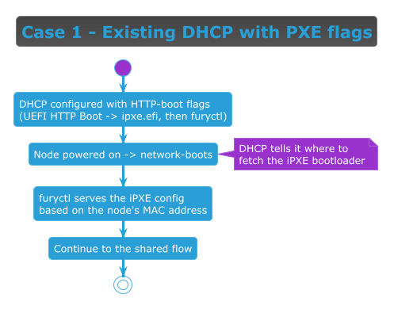

<!-- markdownlint-disable MD013 -->
# Install case: existing DHCP with PXE flags

> Part of the [Immutable install guide](IMMUTABLE_INSTALL.md). Key terms link to their official docs inline.

## When to use this case

Use this case when the network **already has a [DHCP][dhcp] server and you can modify its configuration**. It
needs the least hands-on work per node — the node boots over the network and continues through the
[shared flow](IMMUTABLE_INSTALL.md#shared-flow-every-case); furyctl's role is the same as in every case. The
target node can be **bare metal or a virtual machine** — for a VM, this is a guest on a virtual network whose
DHCP you control (for example a libvirt network or a cloud subnet with custom DHCP options).

## Flow



> [Diagram source](immutable-case-dhcp-pxe.puml) · continues into the
> [Shared flow (every case)](IMMUTABLE_INSTALL.md#shared-flow-every-case).

## How to set it up

You add HTTP-boot options to your **existing** [DHCP][dhcp] server. This case is **UEFI-only**: it uses
[UEFI HTTP Boot][uefi-httpboot] (UEFI 2.5+), where the firmware's built-in HTTP client downloads the boot file
directly over [HTTP][http] — **no [TFTP][tftp] anywhere**. **Legacy BIOS is not supported** (its PXE ROM has no
HTTP client and can only TFTP-boot). [`furyctl`][furyctl] serves only the per-MAC iPXE/[Ignition][ignition]
script on HTTP `:8080`; it does **not** run DHCP and does **not** serve `ipxe.efi`.

There are **three things** to configure (the same on every DHCP server — translate to your product's syntax):

1. **Serve `ipxe.efi` to UEFI HTTP-Boot firmware over HTTP.** The firmware advertises itself with DHCP
   **vendor-class (option 60) `HTTPClient`** (and an HTTP architecture code in option 93, e.g. `0x0010` for
   x86-64 UEFI HTTP). Detect that and return **option 67 as a full URL**: `http://<http-host>/ipxe.efi` — for
   HTTP boot the complete URL replaces the old `next-server` + bare-filename pair. You build/obtain `ipxe.efi`
   from [iPXE][ipxe] ([download][ipxe-download]) and **host it on your own HTTP server** ([nginx][nginx],
   [Caddy][caddy], or `python3 -m http.server`); furyctl does **not** serve it (see the Note).
2. **Echo `HTTPClient` back in option 60 — mandatory.** The firmware **ignores any DHCP offer that does not
   carry vendor-class `HTTPClient`**, so your server must force-send option 60 = `HTTPClient` to HTTP-Boot
   clients. Omitting this echo is the single most common HTTP-boot failure.
3. **Detect the iPXE user-class and chainload to furyctl.** Once `ipxe.efi` loads, iPXE re-requests DHCP with
   user-class (option 77) `"iPXE"`; match that and return the **furyctl per-MAC boot URL**:

   ```text
   user-class (option 77) == "iPXE"
     -> boot file = http://<furyctl-host>:8080/boot/${mac:hexhyp}
   ```

   Only `<furyctl-host>` is yours to fill in; the `/boot/${mac:hexhyp}` path, the port `8080`, and the
   `${mac:hexhyp}` scheme are fixed by furyctl (see the Note).

The [deploy a new DHCP + PXE](install-case-deploy-dhcp.md) case shows a complete, ready-to-run dnsmasq example
of exactly these three rules.

Then:

1. Host `ipxe.efi` on your HTTP server so it is reachable at `http://<http-host>/ipxe.efi`, then apply the
   three rules above to your DHCP server and reload it.
2. Set each node's firmware to **UEFI network boot / HTTP Boot** (bare metal: enable HTTP Boot in UEFI setup;
   VM: put the virtual NIC first in the boot order).
3. Start furyctl so its iPXE/[Ignition][ignition] boot server is serving per-MAC configs — see
   [Installing with furyctl](IMMUTABLE_INSTALL.md#installing-with-furyctl) (`furyctl apply --phase infrastructure`).
4. Power on the nodes. UEFI HTTP-boots `ipxe.efi`, chainloads to furyctl, pulls its config, boots
   [Flatcar][flatcar], and continues through the shared flow.

> **Note:** in `http://<furyctl-host>:8080/boot/${mac:hexhyp}`, the only value you supply is `<furyctl-host>`
> (the host/IP running furyctl). The `/boot/${mac:hexhyp}` path scheme and the default port `8080` are **fixed by
> furyctl** — change the port only if you set `spec.infrastructure.ipxeServer.bindPort`. You do **not** need to
> worry about MAC letter-case: iPXE emits `${mac:hexhyp}` lowercase (e.g. `52-54-00-10-00-01`) and furyctl
> normalizes it server-side. furyctl serves only the per-MAC script — it does **not** serve `ipxe.efi`; host that
> on your own HTTP server.
>
> **Security:** plain HTTP boot is unauthenticated. For production prefer **HTTPS boot** (UEFI 2.5+) or signed
> iPXE images.

<!-- Links -->

[dhcp]: https://datatracker.ietf.org/doc/html/rfc2131
[http]: https://datatracker.ietf.org/doc/html/rfc9110
[tftp]: https://datatracker.ietf.org/doc/html/rfc1350
[uefi-httpboot]: https://ipxe.org/appnote/uefihttp
[ipxe]: https://ipxe.org/
[ipxe-download]: https://ipxe.org/download
[nginx]: https://nginx.org/en/docs/
[caddy]: https://caddyserver.com/docs/
[furyctl]: https://github.com/sighupio/furyctl/
[ignition]: https://coreos.github.io/ignition/
[flatcar]: https://www.flatcar.org/
