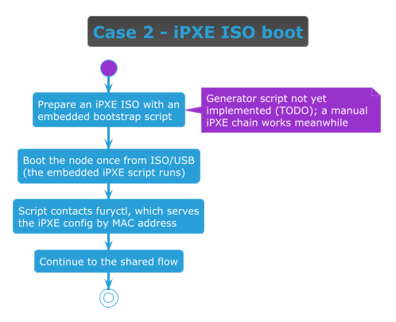

<!-- markdownlint-disable MD013 -->
# Install case: iPXE ISO boot

> Part of the [Immutable install guide](IMMUTABLE_INSTALL.md). Key terms link to their official docs inline.

## When to use this case

Use this case when a [DHCP][dhcp] server **exists but you cannot modify it** (for example a locked-down
corporate network). Instead of changing DHCP, you bootstrap each node **once** from an [iPXE][ipxe] ISO/USB
that knows how to reach [`furyctl`][furyctl]. The target node can be **bare metal or a virtual machine** — for
a VM, the ISO is attached as a virtual CD-ROM instead of a physical USB stick.

## Flow



> [Diagram source](immutable-case-ipxe-iso.puml) · continues into the
> [Shared flow (every case)](IMMUTABLE_INSTALL.md#shared-flow-every-case).

## How to set it up

1. Generate the iPXE ISO:

   > **TODO (script):** the iPXE ISO with the embedded bootstrap script is produced by a generator script
   > (planned: `scripts/build-ipxe-iso.sh`). **This script is not implemented yet** — this step is a
   > placeholder. Once available, it will take the furyctl boot-server address and emit a bootable
   > `ipxe.iso`.

   **Interim (manual), until the script exists:** boot any [iPXE][ipxe] media (the upstream `ipxe.iso` or a
   USB), drop to the iPXE shell (`Ctrl-B`), bring up the network, and chainload furyctl's per-MAC script
   directly (`${mac:hexhyp}` is expanded by iPXE; replace only `<furyctl-host>`):

   ```ipxe
   dhcp
   chain http://<furyctl-host>:8080/boot/${mac:hexhyp}
   ```

2. Make the ISO bootable on the node: write it to a USB stick (bare metal) or attach it as a virtual CD-ROM
   (VM).
3. Start the furyctl install so its iPXE/[Ignition][ignition] server is serving per-MAC configs.
4. Boot the node **once** from the ISO/USB. It reaches furyctl, pulls its config, boots [Flatcar][flatcar],
   and continues through the shared flow. Subsequent boots come from disk.

<!-- Links -->

[dhcp]: https://datatracker.ietf.org/doc/html/rfc2131
[ipxe]: https://ipxe.org/
[furyctl]: https://github.com/sighupio/furyctl/
[ignition]: https://coreos.github.io/ignition/
[flatcar]: https://www.flatcar.org/
