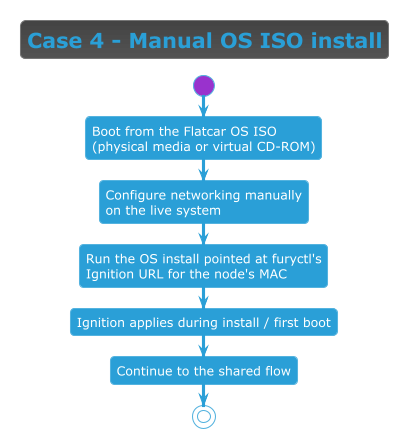

<!-- markdownlint-disable MD013 -->
# Install case: manual OS ISO install

> Part of the [Immutable install guide](IMMUTABLE_INSTALL.md). Key terms link to their official docs inline.

## When to use this case

Use this case as the **fallback** when the segment has **no [DHCP][dhcp] server and you cannot deploy one** (an
isolated or air-gapped environment). There is no network boot here: you boot the [Flatcar][flatcar] OS ISO and
install manually. Only the [Ignition][ignition] config is served by [`furyctl`][furyctl]; everything else is
hands-on. The target node can be **bare metal or a virtual machine** — for a VM, the OS ISO is attached as a
virtual CD-ROM.

## Flow



> [Diagram source](immutable-case-os-iso.puml) · continues into the
> [Shared flow (every case)](IMMUTABLE_INSTALL.md#shared-flow-every-case).

## How to set it up

1. Attach the Flatcar OS ISO to the node (write to USB for bare metal, or mount as a virtual CD-ROM for a VM)
   and boot from it. The live system logs in as the `core` user.
2. **Configure networking** so the node can reach furyctl. With DHCP it is usually already up; for a static
   address set it manually, then confirm furyctl is reachable:

   ```sh
   sudo ip addr add 192.168.1.11/24 dev eth0
   sudo ip link set eth0 up
   sudo ip route add default via 192.168.1.1
   echo "nameserver 8.8.8.8" | sudo tee /etc/resolv.conf
   curl -sf http://<furyctl-host>:8080/status >/dev/null && echo "furyctl reachable"
   ```

3. **Install Flatcar to disk**, using furyctl's per-MAC install Ignition. `flatcar-install` takes a local file,
   so fetch it first. The MAC in the path is hyphen-separated and **uppercase** (e.g. `52-54-00-10-00-01`):

   ```sh
   curl -fsSL http://<furyctl-host>:8080/ignition/<MAC>/install-flatcar.json -o ignition.json
   sudo flatcar-install -d /dev/sda -i ignition.json
   sudo reboot
   ```

4. The node reboots from disk into [Flatcar][flatcar] with Ignition applied and continues through the shared
   flow.

<!-- Links -->

[dhcp]: https://datatracker.ietf.org/doc/html/rfc2131
[flatcar]: https://www.flatcar.org/
[ignition]: https://coreos.github.io/ignition/
[furyctl]: https://github.com/sighupio/furyctl/
